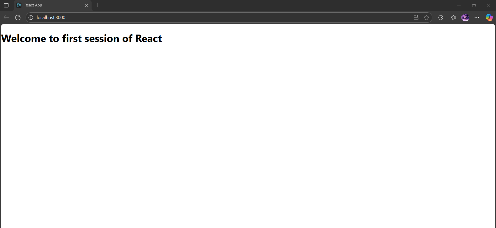

# Exercise 1 – My First React App

This is a simple React application that displays a welcome message using a functional component.

---

## 🔹 Features:
- Displays: **"Welcome to the first session of React"** as a heading
- Built using `create-react-app`

---

## 🖥️ Output:

