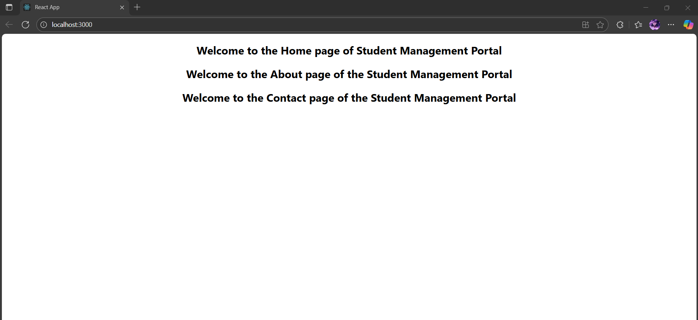

# Exercise 2 – Student Management Portal

This React app demonstrates the use of multiple functional components and how to render them together in a single application.

---

## 🔹 Features:
- `Home`, `About`, and `Contact` components
- Each displays a different message for the Student Management Portal
- Components rendered from `App.js`

---

## 🖥️ Output:

