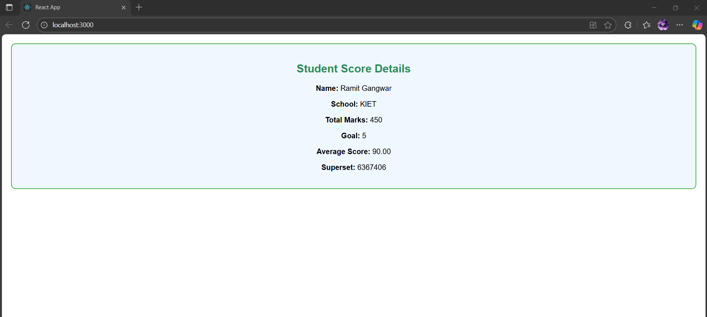

# Exercise 3 – Student Score Calculator

This React application demonstrates the use of **props** and **component styling** using a function component.

---

## 🔹 Features:
- Functional component `CalculateScore` accepts props: name, school, total marks, goal
- Calculates and displays the average score
- Custom styling using external CSS (`mystyle.css`)

---

## 🖥️ Output:

