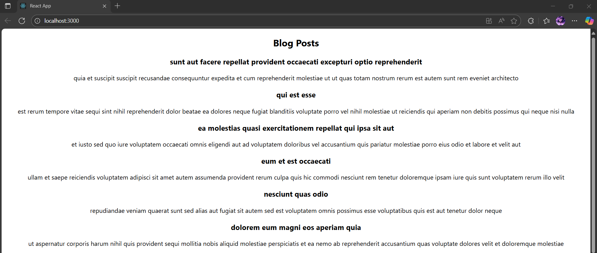

# Exercise 4 – Blog App with Lifecycle Hooks

This React application uses a **class component** and demonstrates **lifecycle methods** like `componentDidMount` and `componentDidCatch`.

---

## 🔹 Features:
- Class component `Posts` fetches blog posts from an external API
- Uses `componentDidMount()` to fetch posts
- Implements `componentDidCatch()` for error handling
- Renders a list of posts using titles and body

---

## 🖥️ Output:

