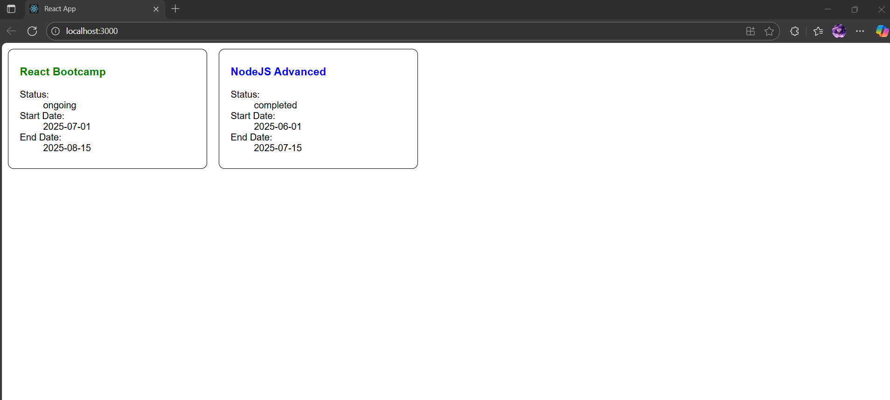

# Exercise 5 – Cohort Dashboard Styling

This application styles React components using **CSS Modules** and **inline styles** for a cohort dashboard.

---

## 🔹 Features:
- Component `CohortDetails` styled using `CohortDetails.module.css`
- Dynamic styling: green for ongoing, blue for completed
- Uses semantic HTML (`<dl>`, `<dt>`, `<dd>`) for displaying details

---

## 🖥️ Output:

