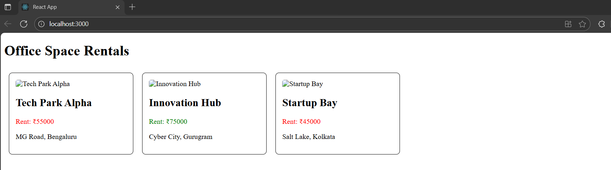

# Exercise 10 – Office Space Rental App (JSX & Inline CSS)

This React application uses JSX to create and render elements, and applies inline CSS for styling based on dynamic conditions.

---

## 🔹 Features:
- Displays office spaces with:
  - Name, rent, address, and image
  - Conditional styling for rent (red if below ₹60,000, green otherwise)
- Uses JSX attributes and expressions for rendering
- Loops through office list using `map()` to display multiple items

---

## 🖥️ Output:

