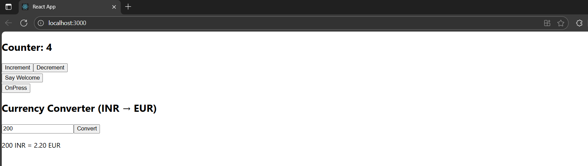

# Exercise 11 – Event Handling App

This React application demonstrates various event handling techniques including multiple method calls, passing arguments, synthetic events, and form submission.

---

## 🔹 Features:
- **Counter** component:
  - Increment button calls multiple methods (increment & sayHello)
  - Decrement button decreases counter value
- **SayWelcome** button:
  - Passes `"Welcome"` as an argument to the event handler
- **SyntheticEventButton**:
  - Handles synthetic `onClick` events
- **CurrencyConverter**:
  - Converts INR to EUR on form submit using `handleSubmit`

---

## 🖥️ Output:

