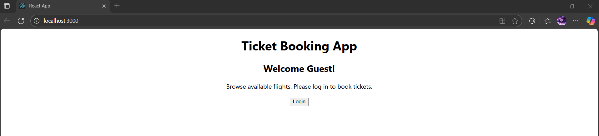
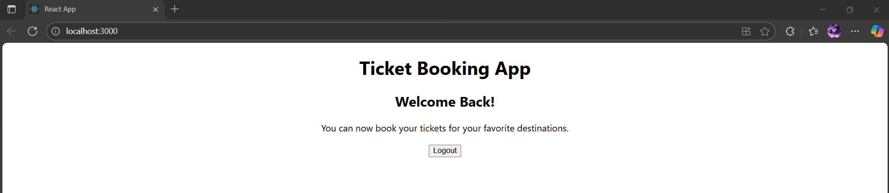

# Exercise 12 – Ticket Booking App (Conditional Rendering)

This React application uses conditional rendering to display different pages for guest and logged-in users.

---

## 🔹 Features:
- **GuestPage**:
  - Displays flight browsing information for unauthenticated users
- **UserPage**:
  - Allows logged-in users to book tickets
- Login/Logout buttons toggle between pages using `useState`

---

## 🖥️ Output:

