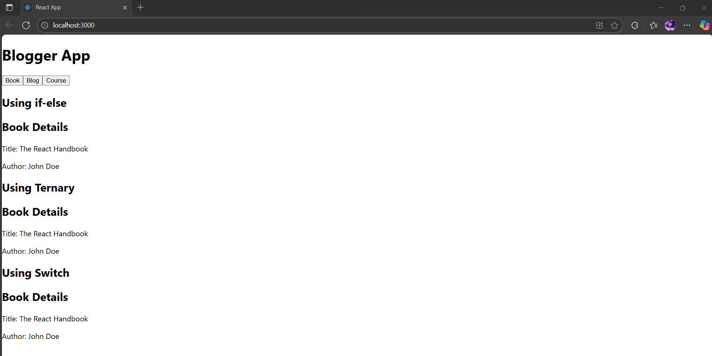

# Exercise 13 – Blogger App (Multiple Conditional Rendering Methods)

This React application demonstrates various ways of conditional rendering across three different components.

---

## 🔹 Features:
- Components:
  - `BookDetails`, `BlogDetails`, `CourseDetails`
- Conditional rendering implemented using:
  - `if-else` statements
  - Ternary operators
  - `switch` statements
- Buttons to toggle between different views

---

## 🖥️ Output:

