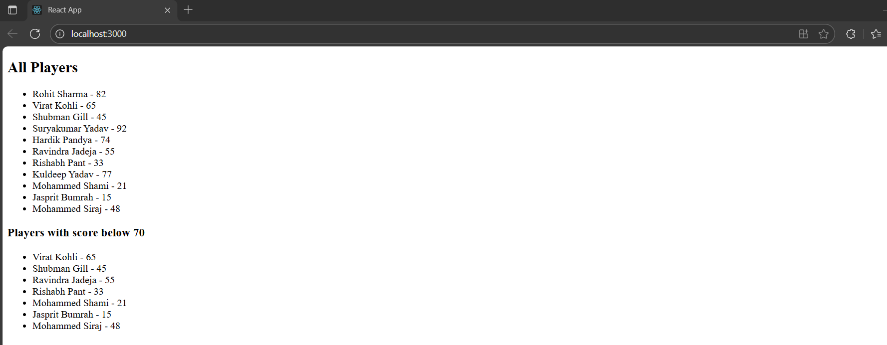
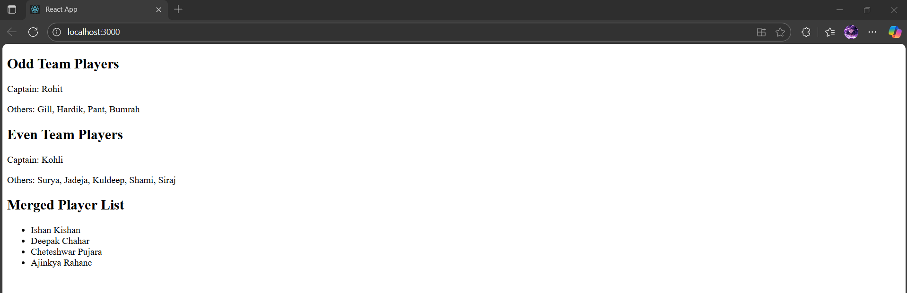

# Exercise 9 – Cricket App (ES6 Features)

This React application demonstrates the use of ES6 features like `map()`, arrow functions, destructuring, and spread/merge in functional components.

---

## 🔹 Features:
- **ListOfPlayers** component:
  - Displays a list of 11 players and their scores using `map()`
  - Filters and displays players with scores below 70 using arrow functions
- **IndianPlayers** component:
  - Uses array destructuring to split odd/even team players
  - Merges T20 and Ranji Trophy players using the spread operator
- Displays one of the two components based on a `flag` variable

---

## 🖥️ Output:

